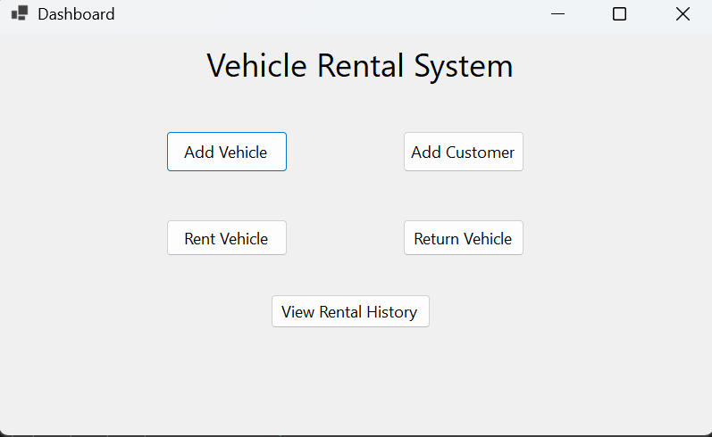
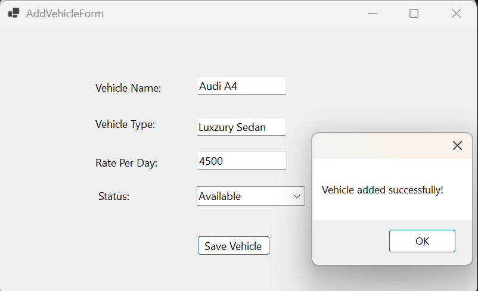
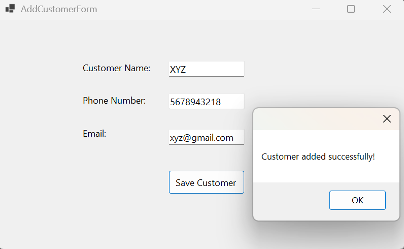
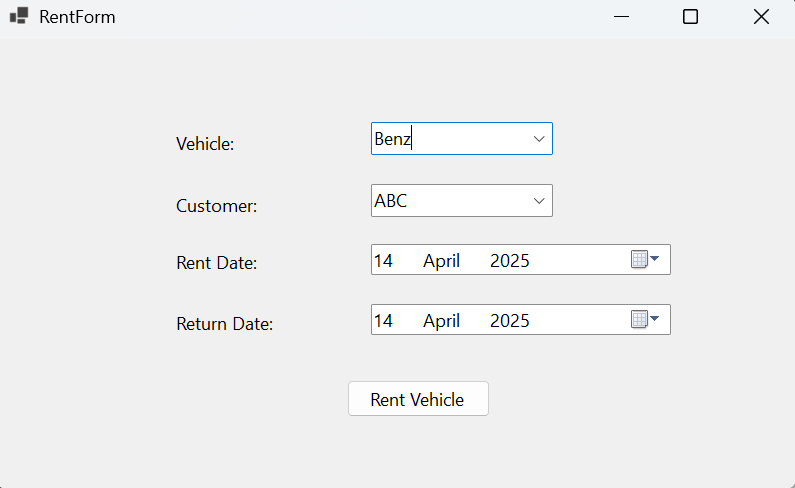
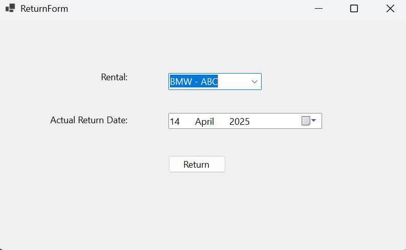
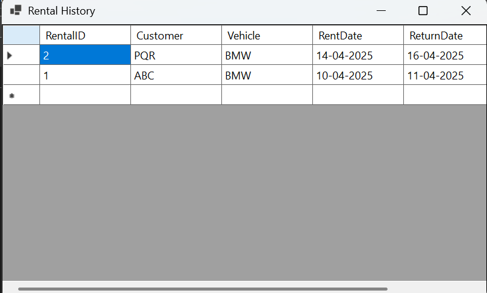

# 🚗 Vehicle Rental System – Windows Forms Application

[](LICENSE)

This is a C# Windows Forms Application developed for managing a basic Vehicle Rental System. It includes functionalities such as vehicle management, customer management, renting, returning, and viewing rental history. The application uses SQL Server as the backend database and WinForms for the GUI.

---

## 📚 Index

1. [Introduction & Objective](#introduction--objective)
2. [Forms & UI Controls Used](#forms--ui-controls-used)
3. [Database Design](#database-design)
4. [Code Overview](#code-overview)
5. [Screenshots](#screenshots)
6. [How to Run](#how-to-run)
7. [License](#license)

---

## 📌 Introduction & Objective

This Vehicle Rental System allows an administrator or employee to manage vehicle rentals, including adding vehicle information, handling customers, renting and returning vehicles, and viewing rental history. The application is developed using **Windows Forms (WinForms)** and **C#**, with data stored and managed in **SQL Server**.

### 🎯 Objective:
- Add and manage vehicles.
- Register and manage customers.
- Record vehicle rentals and returns.
- Track rental history.
- Provide an easy-to-use desktop application interface.

---

## 🧾 Forms & UI Controls Used

### 1. **Vehicle Form**
- TextBoxes
- ComboBox
- Buttons
- DataGridView

### 2. **Customer Form**
- TextBoxes
- Buttons
- DataGridView

### 3. **Rental Form**
- ComboBoxes
- DatePickers
- Buttons
- DataGridView

### 4. **Return Form**
- ComboBoxes
- TextBoxes
- DatePickers
- Buttons
- DataGridView

### 5. **Rental History Form**
- DataGridView

### 6. **Main Form**
- Buttons (Navigation)

---

## 🗃️ Database Design

**Database Name:** `VehicleRentalDB`

### Tables:

#### 🔹 Vehicle
| Column Name     | Data Type     |
|------------------|----------------|
| VehicleID        | int (Primary Key) |
| Make             | varchar(100)   |
| Model            | varchar(100)   |
| Year             | int            |
| LicensePlate     | varchar(50)    |
| Availability     | bit            |

#### 🔹 Customer
| Column Name     | Data Type     |
|------------------|----------------|
| CustomerID       | int (Primary Key) |
| FirstName        | varchar(100)   |
| LastName         | varchar(100)   |
| PhoneNumber      | varchar(15)    |

#### 🔹 Rental
| Column Name     | Data Type     |
|------------------|----------------|
| RentalID         | int (Primary Key) |
| VehicleID        | int (Foreign Key) |
| CustomerID       | int (Foreign Key) |
| RentDate         | date           |
| ReturnDate       | date           |
| RentalStatus     | varchar(50)    |

#### 🔹 Return
| Column Name     | Data Type     |
|------------------|----------------|
| ReturnID         | int (Primary Key) |
| RentalID         | int (Foreign Key) |
| ReturnDate       | date           |
| Fine             | decimal        |

---

## 💻 Code Overview

The full application includes:

- Windows Form design code
- Logic for database connectivity
- SQL queries and database operations (Insert, Update, Delete, Select)
- Namespaces: `System.Data.SqlClient`, `System.Windows.Forms`, `System.Data`, etc.

**➡️ For full code files, refer to the `Forms` and `Database` folder in this repository.**

---

## 📸 Screenshots

> 📁 Store these images inside a folder like `images/` and commit them to your repo.

### 🔹 Main Form  


### 🔹 Vehicle Management Form  


### 🔹 Customer Management Form  


### 🔹 Rental Form  


### 🔹 Return Form  


### 🔹 Rental History Form  


---

## ▶️ How to Run

1. Clone the repository:
   ```bash
   git clone https://github.com/yourusername/vehicle-rental-system.git
